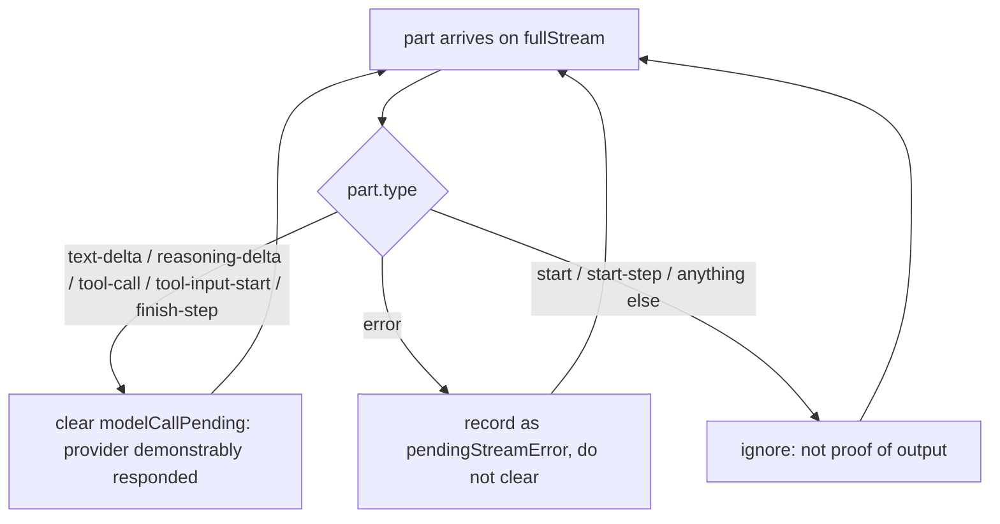

# fix: Diagnose and stop delegated-worker failure loops

## Goal Capsule

When a delegated worker's model call fails, the agent runtime today reports
`No output generated. Check the stream for errors.` and retries until the step
budget is gone. This plan makes that failure **name its own cause** and **stop
the turn**, in four small changes across `packages/agent` and `apps/web`.

Success looks like: one broken subagent model produces one informative message
within three steps, instead of nine steps, 70 seconds, and no answer.

---

## Problem Frame

Production session `T-5pWV3Bz4C_QITlSyPFn`, chat `itSZNUSgb_ikmPSnm7Ukm`,
2026-08-07 10:53 UTC. The user typed the single word `hey`. The run made 9 tool
calls over 69.5s (`workflow.completed`: `stepCount: 9`,
`totalDurationMs: 69467`, `finishReason: "tool-calls"`) and produced no answer.
Seven of those calls were `task`; six returned the byte-identical string
`No output generated. Check the stream for errors.` The turn ended by
exhausting its step budget, leaving a `setup_managed_runtime_profile` approval
card as its only output.

Four independent defects compound into that outcome:

1. The `task` tool discards the provider error the AI SDK already surfaced, so
   the failure has no cause (#1140).
2. The diagnostic that exists for exactly this case is unreachable (#1141).
3. In `managed_runtime` mode `task` is the coordinator's only execution path,
   so a dead `task` leaves it nowhere to go but retry (#1142).
4. Nothing in the step loop notices a tool failing identically over and over
   (#1143).

Fixing 1 and 2 alone yields a well-labelled failure repeated seven times.
Fixing 4 alone stops the burn but leaves the user with three copies of a
message that names no cause. Only together do they produce one informative
failure, fast.

**Out of frame:** why the subagent model failed at the provider level in that
incident. `user_preferences.default_subagent_model_id` pointed at a different
model (`gemma-4-31b`) than the chat model (`gpt-oss-120b`) on the same Cerebras
profile, and every subagent call failed instantly while coordinator calls
succeeded. The provider-level cause was **not verified** — the profile API key
could not be decrypted from the available environment. These four defects are
worth fixing regardless of it, and none of them depend on knowing it.

---

## Requirements

| ID | Requirement | Issue |
|----|-------------|-------|
| R1 | When a delegated worker's model call fails, the error surfaced by the `task` tool contains the provider's own message, not only the AI SDK's generic no-output text. | #1140 |
| R2 | A delegated-worker failure that happens **before** any real provider output is attributed to the model, naming the model id. | #1141 |
| R3 | A delegated-worker failure that happens **after** real provider output keeps its own error and is **not** relabelled as a model failure. | #1141 |
| R4 | After N consecutive failures of the same tool with the same error, the agent turn stops and reports that error, instead of continuing to the step cap. | #1143 |
| R5 | A tool that fails once and then succeeds still completes normally; failures with differing errors do not trip the stop. | #1143 |
| R6 | When the stop fires in `managed_runtime` mode, the user-facing message says delegation is that mode's only execution path, so the reader understands why the turn could not route around it. | #1142 |
| R7 | The managed-runtime coordinator tool set is unchanged — no file/shell tools are re-added. | #1142 |
| R8 | The failure paths above emit structured session events with runtime attribution and a typed error kind. | #1140, #1142, #1143 |

---

## Key Technical Decisions

### KTD1. All four defects ship in one slice

*(session-settled: user-directed — chosen over shipping #1140/#1141 first and
deferring #1142/#1143: the user was offered exactly that split and chose all
four. #1142 and #1143 are what convert a diagnosable failure into a budget
burn, so the error-plumbing fixes alone would produce a well-labelled message
repeated seven times.)*

Governs R1–R8.

### KTD2. The managed-runtime coordinator does not get file tools back

*(session-settled: user-approved — chosen over restoring `read`/`grep`/`glob`/
`bash` to `MANAGED_RUNTIME_COORDINATOR_TOOL_NAMES`: that narrowing was a
deliberate shipped fix in cea76ec3 / PR #1136. Undoing it to give the
coordinator a fallback would regress a solved problem.)*

Governs R7. #1142 is satisfied by making the dead path terminal, not by
widening the tool set.

### KTD3. Extend the existing repetition detector; do not write a second one

`apps/web/lib/background-agents/action-repetition.ts` already implements this
pattern. It is pure, unit-tested, and was built for exactly this class of
problem (#915): `hashTurnToolCalls` produces a stable per-turn signature and
`detectRepetition` returns a verdict flagging either a `repeat` (the same
signature N times running) or a `cycle` (a short repeating block like A,B,A,B),
with a configurable threshold. The background-agent executor already ORs its
verdict into a stop path and emits
`background-agent.progress.repetition_detected`.

This plan reuses that module rather than adding a parallel one. The only gap is
identity: the existing hash covers tool **name + input**, and this breaker needs
tool **name + error text**. That is one sibling hash function in the same file,
feeding the same `detectRepetition` — which means cycle detection comes along
for free, covering the interleaved shape the incident actually showed
(`task, task, task, todo_write, task, task, task`) without designing for it
separately.

Import it directly from `apps/web/lib/background-agents/action-repetition`. The
module lives under `background-agents/` for historical reasons but is generic —
its own header calls it "reusable from the executor loop." Moving it to a
neutral folder is churn that would touch the background-agent tests for no
behavior gain; leave it where it is.

Alternative rejected: a new `repeated-tool-failure.ts` module in
`app/workflows/`. It would duplicate the signature/threshold/verdict machinery
that already exists and passes tests, and would not get cycle detection.

Alternative rejected: a delegation-specific guard in the `task` tool. It would
only see its own failures, would not cover the same pathology in any other
tool, and would need its own persistence across steps.

### KTD3b. The breaker lives in the chat step loop

The step loop in `apps/web/app/workflows/chat.ts` (~1966–2054) is the only
place that sees every tool result across every runtime mode.

The runtime mode does **not** change the stop decision — N identical failures
is terminal in any mode. It changes only the **explanation**: in
`managed_runtime`, the message additionally states that delegation was the only
execution path available. That is a message-content branch, not a second
mechanism.

### KTD4. Threshold N = 3, identity = tool name + error text

Three is first call, one retry, one confirmation — enough to let a genuinely
transient failure recover, few enough that the remaining budget is preserved.
It is a named constant, not a literal.

Identity compares the tool name **and** the error text. Tool name alone would
trip on a tool legitimately failing three different ways; error text alone
would conflate distinct tools sharing a generic message — which is precisely
the pre-#1140 world this plan is leaving.

Consecutive, not cumulative: the counter resets on any success or any
different failure, so an intermittently-failing tool never accumulates its way
into a false stop. `detectRepetition`'s `countTrailingRepeat` already has
exactly this semantics.

**Accepted trade-off:** a genuinely transient fault that produces the *same*
error text three times running — three consecutive `fetch failed`s from one
network blip — will trip the breaker. That is deliberate. The cost is one
turn the user re-sends; the alternative is the 70-second silent burn this plan
exists to remove. The terminal message says how many times the tool was
retried, so re-sending is an informed choice rather than a guess.

Verified against the incident: its first three steps were consecutive `task`
failures with identical error text, so a threshold of 3 fires at step 3 —
before the `todo_write` at step 5 that a naive counter would have let reset it.

### KTD5. The existing subagent-failure tests pass against an unrealistic double

`packages/agent/tools/tools.test.ts:1548` ("reports an unreachable subagent
model as a model failure") is green today, yet production shows zero
`subagent_model_failed:` prefixes across seven failures. The mock explains the
gap: it makes `ToolLoopAgent.stream` **throw synchronously**.

```ts
mockToolLoopAgentStream = mock(() => {
  throw new Error("fetch failed");
});
```

The real AI SDK does not throw from `stream()` on a provider failure. It
returns a stream object, enqueues `{ type: "start" }` before the request is
made (`ai/dist/index.mjs:6844`), surfaces the failure as an `error` part, and
rejects the derived `response` promise with `NoOutputGeneratedError`
(`ai/dist/index.mjs:6748`, when `recordedSteps.length === 0`).

So the test proves a code path that production never takes. **Repairing the
double is therefore the first unit of work, not a cleanup afterwards** — and
making it realistic is what turns the #1141 assertion red honestly rather than
by contrivance.

Governs R2, R3.

### KTD6. Reuse the existing tool-part helpers rather than adding parsing

`chat.ts` already has `isToolUIPart` and inspects `part.state` /
`"output-error"` (lines ~143–165). The breaker reads the same shapes. No new
part parsing, no new type.

---

## High-Level Technical Design

Failure propagation today versus after this plan:

```mermaid
sequenceDiagram
    participant Loop as chat.ts step loop
    participant Task as task tool
    participant SDK as AI SDK stream
    participant Prov as provider

    Note over Loop,Prov: TODAY
    Loop->>Task: call task
    Task->>SDK: subagent.stream()
    SDK->>SDK: enqueue {type:"start"}
    Note right of Task: modelCallPending cleared here (defect #1141)
    SDK->>Prov: request
    Prov--xSDK: failure
    SDK->>Task: {type:"error", error}
    Note right of Task: dropped — loop handles only tool-call/finish-step (#1140)
    SDK--xTask: response rejects (NoOutputGeneratedError)
    Task--xLoop: "No output generated. Check the stream for errors."
    Loop->>Task: call task (again, x6)
    Note over Loop: no guard — runs to the step cap (#1143, #1142)
```

```mermaid
sequenceDiagram
    participant Loop as chat.ts step loop
    participant Task as task tool
    participant SDK as AI SDK stream
    participant Prov as provider

    Note over Loop,Prov: AFTER
    Loop->>Task: call task
    Task->>SDK: subagent.stream()
    SDK->>SDK: enqueue {type:"start"}
    Note right of Task: guard NOT cleared on start (U3)
    SDK->>Prov: request
    Prov--xSDK: failure
    SDK->>Task: {type:"error", error}
    Note right of Task: captured as the cause (U2)
    Task--xLoop: subagent_model_failed: model "<id>" ... <provider message>
    Loop->>Task: call task (retry 2, retry 3)
    Note over Loop: 3 identical failures -> stop, report the cause (U4)
    Loop-->>Loop: workflow.tool.repeated-failure
```

Guard-clearing decision, stated once so U2 and U3 cannot drift. Note this is an
**allowlist of output-bearing parts**, not a denylist of `start`. The SDK also
emits `start-step` (`ai/dist/index.mjs:7954`), and whether that precedes the
provider's first token is an SDK internal this plan should not depend on — an
allowlist is correct either way, a denylist is only correct if `start` is the
sole pre-output part.



---

## Implementation Units

### U1. Make the delegated-worker test double behave like the AI SDK

**Goal:** Replace the synchronous-throw mock with one that matches real AI SDK
streaming semantics, so the #1140 and #1141 assertions can be written honestly.
This unit is test-only and is expected to leave the suite **red**.

**Requirements:** R2, R3 (enables), KTD5.

**Dependencies:** none.

**Files:**
- `packages/agent/tools/tools.test.ts` (modify)

**Approach:**

1. Add a helper that builds a realistic failing subagent stream: `stream()`
   resolves; `fullStream` yields `{ type: "start" }`, then
   `{ type: "error", error }`; `response` rejects with an error whose message is
   `No output generated. Check the stream for errors.`
2. Add a matching helper for the post-output case: `{ type: "start" }`, then a
   real `tool-call` part, then a failure.
3. Rewrite the existing test at ~1548 to use the pre-output helper. It should
   now fail — that is the #1141 red state, and it is the honest one.
4. Keep the existing post-output test at ~1588 semantically identical but move
   it onto the new helper so both cases share one double.
5. Add the #1140 assertion: the thrown error text contains the provider
   message carried on the `error` part.

**Execution note:** This unit's deliverable is a confirmed red state. Record
the failing output before starting U2 — it is the TDD audit trail for #1140 and
#1141.

**Patterns to follow:** the existing `mockToolLoopAgentStream` assignment style
and the `createGitWorkspace` / `executionOptions` / `createContext` helpers
already in this file.

**Test scenarios:**
- Pre-output provider failure: the thrown error contains `subagent_model_failed`, the model id `test-model`, and the provider message; it contains neither `drift` nor `baseline`. *(red until U3)*
- Pre-output provider failure: the thrown error contains the provider's own message text and not only the generic no-output string. *(red until U2)*
- Post-output failure (a `tool-call` part was yielded first): the thrown error is exactly the tool's own message and does not contain `subagent_model_failed`. *(must stay green through U2 and U3)*

**Verification:** `bun test packages/agent/tools/tools.test.ts` fails on the two
pre-output assertions and passes the post-output assertion.

---

### U2. Surface the delegated worker's provider error

**Goal:** Capture the `error` part the AI SDK emits on `fullStream` and carry it
as the cause of the error the `task` tool throws, so R1 holds.

**Requirements:** R1, R8. Implements KTD1 for #1140.

**Dependencies:** U1.

**Files:**
- `packages/agent/tools/task.ts` (modify)
- `packages/agent/tools/tools.test.ts` (assertions from U1 go green)

**Approach:**

1. In the `for await (const part of result.fullStream)` loop (~709), add an
   `error`-part branch that records the error on a local (e.g.
   `pendingStreamError`). Do not throw from inside the loop — let the stream
   drain so existing lifecycle and lease release paths behave unchanged.
2. When `await result.response` rejects, prefer `pendingStreamError` as the
   cause: compose the thrown message from it, and attach it via
   `{ cause }` so downstream consumers can still reach the original.
3. Emit the `delegated-worker.model-failed` session event with
   `{ sessionId, chatId, workflowRunId, workerId, workerType, modelId, errorKind }`.
   Route the provider message through the existing session-event redaction
   boundary; never log the API key or `Authorization` header.
4. **Bound and sanitize the provider message on the thrown-error path too, not
   only in the event payload.** The thrown message becomes the tool part's
   `errorText`, is persisted to `chat_messages.parts`, and is rendered to the
   user — a wider exposure than the session event. A verbose provider error can
   echo request context back. Truncate to a sane length and run it through the
   same redaction boundary before it reaches the error message.
5. `reason_code` on `delegated_worker_runs` is out of scope for this slice; see
   Deferred to Follow-Up Work.

**Execution note:** Smallest change that turns U1's provider-message assertion
green without disturbing the post-output case.

**Patterns to follow:** the existing `emitSessionEvent` call sites in
`apps/web/app/workflows/chat.ts` for event shape; the existing
`buildTerminalCompletionPacket` / `appendLifecycleEvent` ordering in `task.ts`
for where the new branch sits.

**Test scenarios:**
- A pre-output `error` part carrying `HTTP 404 model_not_found` produces a thrown error whose message includes that text.
- The original error object is reachable as the thrown error's `cause`.
- A stream that emits no `error` part but still rejects falls back to the SDK message rather than throwing on an undefined cause.
- An over-long provider message is truncated in the thrown error rather than passed through whole.
- A provider message containing a credential-shaped token is redacted on the thrown-error path, not only in the session event.
- The post-output case from U1 is unaffected.

**Verification:** U1's provider-message assertion passes; the post-output
assertion still passes; `bun test packages/agent` is green apart from U1's
still-red #1141 assertion.

---

### U3. Clear the model-call guard only on real provider output

**Goal:** Make the `subagent_model_failed` wrapper reachable, so R2 holds
without breaking R3.

**Requirements:** R2, R3. Implements KTD1 for #1141.

**Dependencies:** U1, U2.

**Files:**
- `packages/agent/tools/task.ts` (modify)
- `packages/agent/tools/tools.test.ts` (assertion from U1 goes green)

**Approach:**

1. Stop clearing `modelCallPending` unconditionally at the top of the loop body.
   Clear it only on an **allowlist** of output-bearing part types — per the
   flowchart in High-Level Technical Design. Do not write this as "everything
   except `start`": the SDK also emits `start-step`
   (`ai/dist/index.mjs:7954`), and a denylist is only correct if `start` is the
   sole pre-output part, which this plan does not assume.
2. Update the comment above the clear so it describes what the code does. The
   current comment claims the flag clears "on the first part actually yielded,
   which is the earliest point at which the model is demonstrably producing
   output" — `{type:"start"}` is not that point, and the comment is why the
   defect survived review.
3. Verify the wrapper composes with U2: the wrapped message must carry the
   provider cause, not re-flatten to the generic text.

**Execution note:** The risk here is over-correction. R3's post-output test is
the guard — confirm it stays green rather than assuming it.

**Patterns to follow:** none new; this is a narrowing of an existing condition.

**Test scenarios:**
- Pre-output failure: thrown message starts with `subagent_model_failed` and names the model id.
- Pre-output failure: the wrapped message also contains the provider message from U2 (the two fixes compose).
- Pre-output failure: the message contains neither `drift` nor `baseline`.
- Post-output failure (a `tool-call` part yielded first): the message is the tool's own and is **not** wrapped.
- A stream that yields `start` **and** `start-step` before failing is still treated as pre-output and is wrapped (the allowlist case that a denylist would get wrong).
- An aborted stream is still rethrown unwrapped, unchanged from today.

**Verification:** `bun test packages/agent/tools/tools.test.ts` fully green.

---

### U4. Stop the turn after repeated identical tool failures

**Goal:** Add the circuit breaker to the chat step loop, so R4, R5, and R6 hold.

**Requirements:** R4, R5, R6, R7, R8. Implements KTD1 for #1142 and #1143,
under KTD3, KTD3b, KTD4, KTD6.

**Dependencies:** U2 (the breaker reports the error text U2 makes meaningful).

**Files:**
- `apps/web/lib/background-agents/action-repetition.ts` (modify — add the
  failure-signature hash alongside the existing `hashTurnToolCalls`)
- `apps/web/lib/background-agents/action-repetition.test.ts` (modify — unit
  coverage for the new hash)
- `apps/web/app/workflows/chat.ts` (modify — wire the detector into the step
  loop)
- `apps/web/app/workflows/chat.test.ts` (modify — loop-level proof)

**Approach:**

1. Add `hashTurnToolFailures` to `action-repetition.ts`, mirroring
   `hashTurnToolCalls` but hashing tool **name + error text** over the failed
   tool parts of a turn, and returning `null` for a turn with no failures.
   Reuse the existing `stableStringify` and sha256 digest so the value stays
   log-safe with no raw error text leaking. Keep the module pure.
2. In the step loop (~2041), after `shouldContinue` is computed, append the
   step's failure signature to a rolling array and pass it to the existing
   `detectRepetition` with `repeatThreshold` = the new constant (3, KTD4). A
   `null` signature (no failures this turn) resets the array — that is R5's
   fail-then-succeed case.
3. On a flagged verdict, emit `workflow.tool.repeated-failure` (warn) with
   `{ sessionId, chatId, workflowRunId, requestId, toolName, failureCount, stepNumber, errorKind, reason }`
   — carrying `verdict.reason` so `repeat` and `cycle` are distinguishable —
   send a terminal text message naming the tool, the repeated error, and the
   retry count, and break.
4. Give `workflow.completed` a `stopReason` discriminator so
   `repeated_tool_failure` is distinguishable from a normal finish and from the
   step cap. The existing `exhaustedMaxSteps` → `workflowStatus = "failed"`
   mapping at ~2325 stays as it is.
5. R6's managed-runtime clause: when `runtime.runtimeMode === "managed_runtime"`,
   the terminal message adds that delegation is the only execution path in that
   mode. Message content only — the stop decision is mode-independent per KTD3b.
6. Reuse `isToolUIPart` and the `"output-error"` state check already in this
   file (~143–165). Reuse `getUserFacingWorkflowErrorMessage` for the rendered
   text where it fits.
7. Do not touch `MANAGED_RUNTIME_COORDINATOR_TOOL_NAMES` (R7).

**Execution note:** Write the `hashTurnToolFailures` unit tests first — they are
cheap and cover R5's over-correction cases without booting the whole workflow.
Then add the loop-level proof. `detectRepetition` itself needs no new tests; it
is already covered.

**Patterns to follow:** `apps/web/lib/background-agents/executor.ts` (~1479–1535)
is the working precedent — it builds a turn signature, feeds `detectRepetition`,
emits `background-agent.progress.repetition_detected`, and ORs the verdict into
its stop path. Mirror that shape. Also `shouldPauseForToolInteraction` and
`shouldRefreshDiffCacheForParts` in `chat.ts` for the part-inspection shape, and
the existing `isNonRetryableProviderError` early-stop for the precedent of
ending a turn before the cap.

**Test scenarios:**
- Same tool, same error text, three consecutive steps: the loop stops at step 3 and does not reach the step cap.
- The terminal assistant message names the tool, the repeated error text, and the retry count.
- `workflow.tool.repeated-failure` is emitted once, with the correlation fields listed above.
- `workflow.completed` carries `stopReason: "repeated_tool_failure"`.
- **Must stay green:** a tool that fails once then succeeds completes normally and never trips the breaker.
- **Must stay green:** the same tool failing with three *different* error texts does not trip the breaker.
- **Must stay green:** two different tools each failing twice does not trip the breaker.
- A failure, then a success, then two more identical failures does not trip (the counter reset holds).
- In `managed_runtime` mode the terminal message additionally states delegation was the only execution path; in `classic` mode it does not.
- `hashTurnToolFailures` returns `null` for a turn with no failed tool parts, and equal digests for two turns whose failed parts share tool name and error text.
- The digest does not contain the raw error text (log-safety, mirroring `hashTurnToolCalls`).
- `MANAGED_RUNTIME_COORDINATOR_TOOL_NAMES` is unchanged (assert the existing allowlist test in `packages/agent/open-agent.test.ts` still passes).
- **Must stay green:** the background-agent executor's existing repetition behavior is unaffected by the module gaining a sibling function.

**Verification:** `bun test apps/web/app/workflows` and
`bun test apps/web/lib/background-agents` green, including all must-stay-green
cases; the identical-failure run's step count drops from the cap to 3.

---

## Verification Contract

| Gate | Command | Expectation |
|------|---------|-------------|
| U1 red state | `bun test packages/agent/tools/tools.test.ts` | Two pre-output assertions fail; post-output assertion passes. Capture the output. |
| Agent package | `bun test packages/agent` | Green after U3. |
| Web workflows | `bun test apps/web/app/workflows` | Green after U4, including every must-stay-green case. |
| Background agents | `bun test apps/web/lib/background-agents` | Green after U4 — proves the shared repetition module was extended additively. |
| Whitespace | `git diff --check` | Clean. |
| Full CI | `bun --bun run ci` | Green, or pre-existing failures documented. |

Commit shape: one red test-only commit (U1), then a green commit per fix (U2,
U3, U4), so the TDD audit trail the four issues ask for is visible in git
history.

---

## Scope Boundaries

**In scope:** the four defects above, their regression tests, and the
structured events named in R8.

**Out of scope:**
- The provider-level cause of the incident (unverified; see Problem Frame).
- Changing `default_subagent_model_id` or any user's inference profile. That is
  a settings change the user can make directly and is not a code fix.
- Reworking `delegated_worker_runs.reason_code` taxonomy beyond what falls out
  of U2.
- Any change to the managed-runtime coordinator tool set (R7, KTD2).

### Deferred to Follow-Up Work
- Cause-bearing `reason_code` values on `delegated_worker_runs` rows, replacing
  the undifferentiated `task_output_error`. Useful, but it is a data-model
  change with its own migration question and does not block the user-facing fix.
- An audit of other AI SDK stream consumers in the repo for the same
  dropped-`error`-part pattern. U2 fixes the one with a confirmed production
  incident; a sweep is a separate slice.
- The agent-loop chain runner (`apps/web/lib/agent-loops/chain.ts`) does not
  share `runAgentWorkflow` and so does not get U4's breaker. The background-agent
  executor already has equivalent protection from #914/#915, so this is the one
  remaining uncovered runner. Worth its own slice; not blocking, because the
  reported incident was a chat turn.

---

## Assumptions

Recorded because this plan was written in pipeline mode without a scoping
confirmation:

1. **Threshold N = 3** is assumed acceptable (KTD4). The issue proposed it; it
   was listed as an open area. If review prefers a different value, it is a
   one-constant change.
2. **One breaker, in the chat step loop, reusing the existing detector**
   (KTD3, KTD3b) resolves the open question of how #1142 and #1143 divide. The
   alternative — a second guard inside `packages/agent`, or a fresh module in
   `app/workflows/` — was rejected as duplicated state.
3. **The existing `isNonRetryableProviderError` path is not reused** for the
   transient/terminal split. It classifies *provider* refusals of the
   coordinator's own request; a repeatedly-failing tool is a different signal.
   The breaker is new, small, and pure.
4. **The realistic test double is a prerequisite, not a cleanup** (KTD5, U1).
   Without it the #1141 assertion cannot be made to fail honestly.

---

## Risks & Dependencies

| Risk | Mitigation |
|------|-----------|
| Over-correcting U3 wraps post-output failures as model failures, mislabelling real tool errors. | R3's post-output test is written in U1, before U3, and must stay green. |
| Over-correcting U4 cuts off legitimate retry loops. | Three must-stay-green scenarios in U4 (fail-then-succeed, differing errors, two tools interleaved) plus the consecutive-not-cumulative reset. |
| U1 leaves the suite red between commits. | Intentional and bounded to one commit; the Verification Contract records the expected red output as the audit trail. |
| U4 modifies a module the background-agent executor depends on. | The change is additive — a sibling function beside `hashTurnToolCalls`, no edit to `detectRepetition` or the existing hash. `bun test apps/web/lib/background-agents` is a required gate. |
| `start-step` (or a future SDK part type) silently clears the U3 guard again. | The allowlist shape means a new part type defaults to "not proof of output", which fails safe. A denylist would have the opposite default. |
| Redaction gap: the provider message may contain sensitive text. | U2 routes it through the existing session-event redaction boundary; the API key and `Authorization` header are never logged. |

---

## Definition of Done

- [ ] U1's red state captured and committed as a test-only commit.
- [ ] U2, U3, U4 each landed as a separate green commit.
- [ ] R1–R8 each covered by at least one assertion.
- [ ] All three must-stay-green over-correction cases pass.
- [ ] `MANAGED_RUNTIME_COORDINATOR_TOOL_NAMES` unchanged (R7).
- [ ] `bun test packages/agent` green.
- [ ] `bun test apps/web/app/workflows` green.
- [ ] `bun test apps/web/lib/background-agents` green (shared module extended additively).
- [ ] `git diff --check` clean.
- [ ] `bun --bun run ci` green, or pre-existing failures documented.
- [ ] PR into `develop` referencing #1140, #1141, #1142, #1143, with the PR-body
      sections the repo's CLAUDE.md requires.
- [ ] Release PR `develop` → `main` opened so the fix reaches production.

---

## Sources & Research

- **Incident:** production session `T-5pWV3Bz4C_QITlSyPFn`, chat
  `itSZNUSgb_ikmPSnm7Ukm`, production database `ep-soft-silence`. Read from
  `chat_messages`, `delegated_worker_runs`, `session_events`,
  `user_preferences` on 2026-08-07.
- **Issues:** #1140, #1141, #1142, #1143 — full evidence, regression plans, and
  observability contracts.
- **Code:** `packages/agent/tools/task.ts` (~682, ~709, ~830–840);
  `packages/agent/open-agent.ts` (~220);
  `apps/web/app/workflows/chat.ts` (~143–165, ~1966–2054, ~2325, ~3280);
  `apps/web/lib/background-agents/action-repetition.ts` (the module KTD3 reuses);
  `apps/web/lib/background-agents/executor.ts` (~1479–1535, the working precedent).
- **AI SDK 6.0.168:** `ai/dist/index.mjs:6748` (`NoOutputGeneratedError` when
  `recordedSteps.length === 0`), `:6844` (`{type:"start"}` enqueued in
  `start(controller)` before the provider request), `:7954` (`start-step`,
  the part type that makes an allowlist necessary in U3).
- **Prior slices reused:** #914 (no-progress budget) and #915
  (action-repetition / cycle detection) built the detector KTD3 extends.
- **Existing tests inspected:** `packages/agent/tools/tools.test.ts:1548` and
  `:1588` — the source of KTD5.
- **Prior decision:** cea76ec3 / PR #1136 removed file tools from the
  managed-runtime coordinator prompt (KTD2).
- **Repo process:** `docs/process/behavior-tdd.md`,
  `docs/process/observability-discipline.md`,
  `docs/process/managed-runtime-proof-standard.md`,
  `docs/process/feature-ticket-format.md`.
- **External research:** none run. The defects and their fixes are entirely
  internal to this repo and the pinned AI SDK version, whose behavior was read
  from the installed source rather than from documentation.
